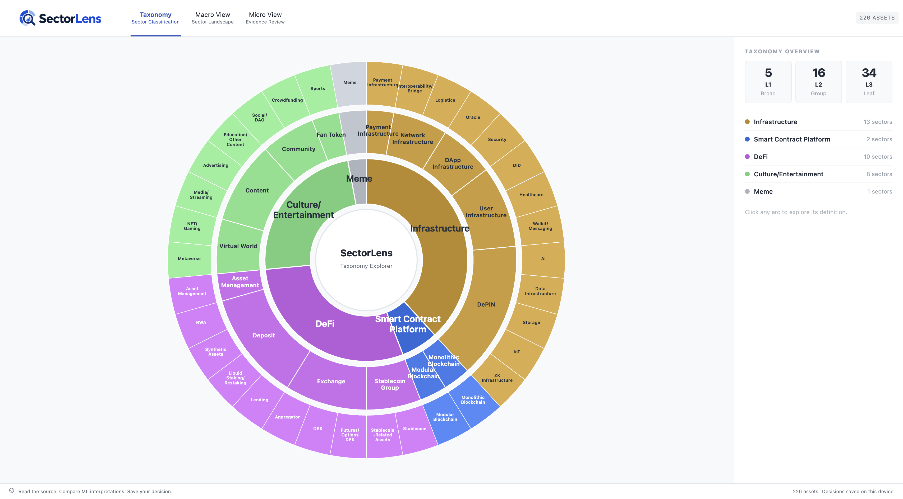
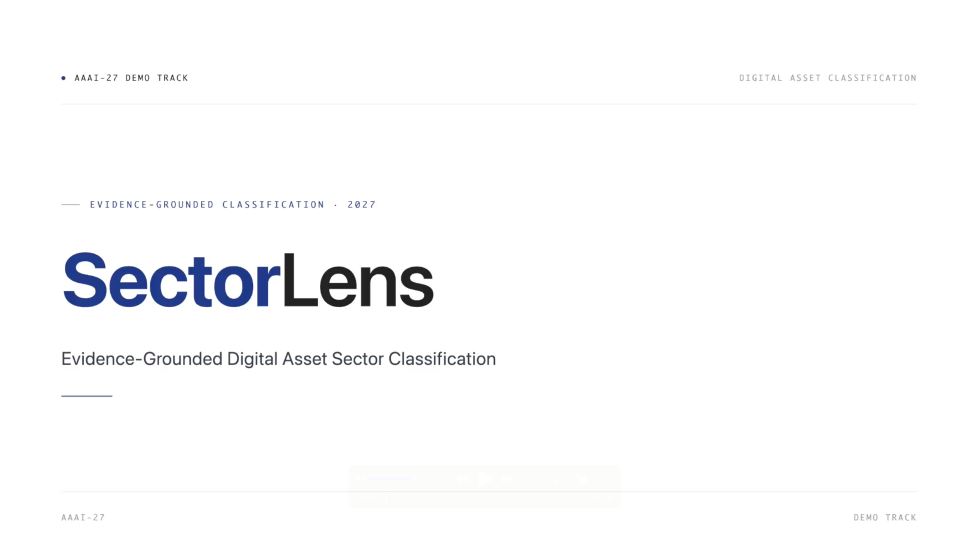

# SectorLens: Evidence-Grounded Digital Asset Sector Classification

## 📃 Demo Website

  

  Click the image above to experience SectorLens system.

  

## 📽️ Demo Video

  

  Click the image above to watch the full demo.

  

## Abstract
Sector classifications provide a common structure for asset comparison, valuation, and portfolio construction in traditional financial markets. Applying such structured taxonomies to digital assets, however, requires experts to interpret long and heterogeneous official documents, making large-scale review time-consuming and difficult to reproduce consistently. We present SectorLens, an evidence-grounded, human-in-the-loop system that combines dense semantic retrieval, sector-prototype matching, and lexical classification to rank hierarchical sector candidates with supporting evidence from official sources. Its macro-to-micro interface connects taxonomy-level exploration with source-level verification by highlighting relevant whitepaper passages alongside the original document. Reviewers can inspect the evidence and approve, revise, or defer model recommendations while preserving source provenance. Evaluated on 226 digital assets across 34 fine-grained L3 sectors, SectorLens achieves Hit@1 of 0.593 and Hit@3 of 0.792, demonstrating its potential to support transparent and efficient digital asset taxonomy review.

